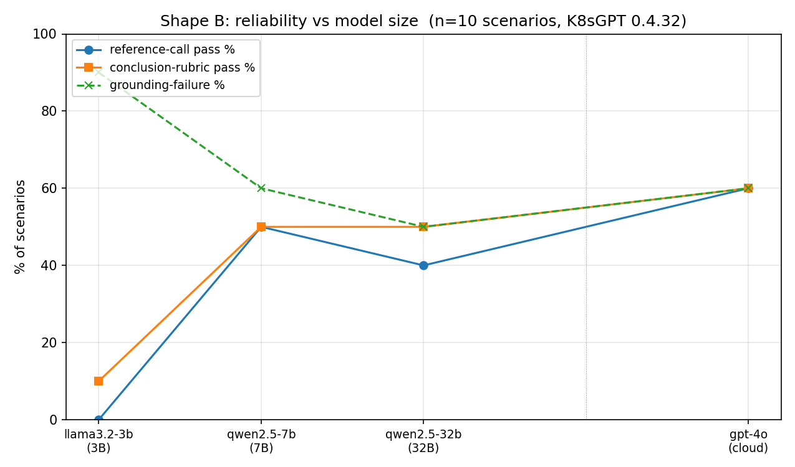
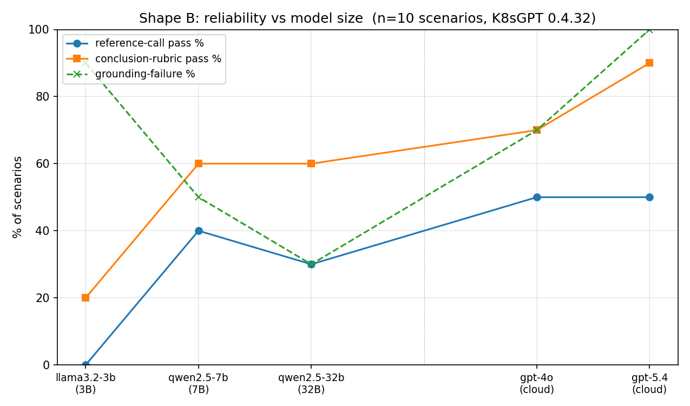
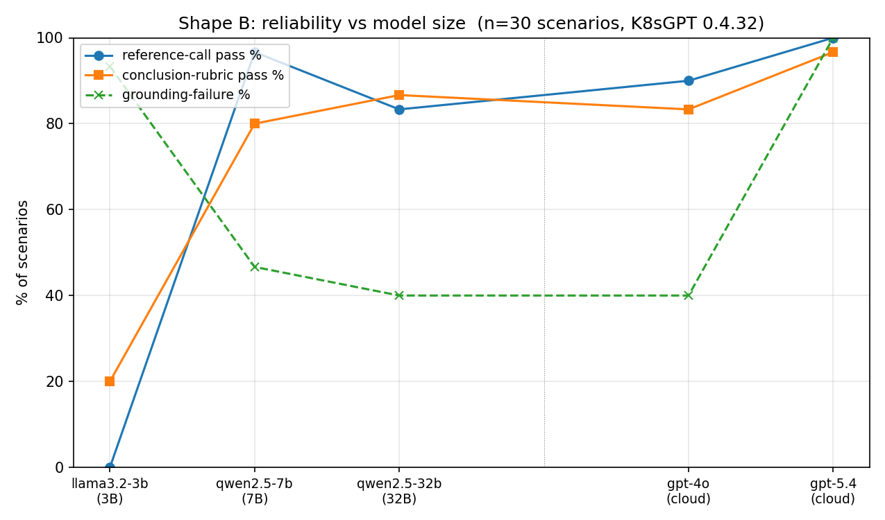

# Phase 3 baseline benchmark — first results

These are the headline `summary.json` artifacts from the first benchmark
runs against the kubelm scenario library. Per-run trajectories live
elsewhere (gitignored under `eval/results/<run-id>/`); this directory
only carries the cross-model summaries that document the published
numbers.

Each file is a self-contained record: scenarios used, model lineup
(`backend_url`, `model`, `temperature`, `max_tokens`), `k8sgpt_version`,
`mcp_protocol_version`, `cluster_strategy`, `parallelism`, every
per-`(model × scenario)` run with its five-metric report, and per-model
totals.

## 2026-05-07 — Shape A: `llama3.2:3b` vs `gpt-4o-mini`

Smoke run that proved the pipeline. 2 models × 10 scenarios = 20 runs,
~15 min wall-time on M1 Max 64 GB.

| model | complete | schema | ground_fail | ref_pass | rubric_pass | errored |
|---|---|---|---|---|---|---|
| llama3.2-3b | 0/10 | 10/10 | 9 | 0/10 | 1/10 | 0 |
| gpt-4o-mini | 10/10 | 10/10 | 5 | 3/10 | 8/10 | 0 |

**File:** `shape-a-2026-05-07.json`

## 2026-05-07 — Shape B: 4-model size curve

3B → 7B → 32B → cloud frontier. 4 models × 10 scenarios = 40 runs,
~32 min wall-time on M1 Max 64 GB. (Llama 3.3 70B was the original
"large local" target but OOM'd alongside kind/Docker — qwen2.5:32b is
the local stand-in until a GPU-box benchmark fills in the 70B point.)

| model | complete | schema | ground_fail | ref_pass | rubric_pass | duration_s |
|---|---|---|---|---|---|---|
| llama3.2-3b | 0/10 | 10/10 | 9 | 0/10 | 1/10 | 295 |
| qwen2.5-7b | 10/10 | 10/10 | 6 | 5/10 | 5/10 | 454 |
| qwen2.5-32b | 10/10 | 10/10 | 5 | 4/10 | 5/10 | 878 |
| gpt-4o | 10/10 | 10/10 | 6 | 6/10 | 6/10 | 303 |

**File:** `shape-b-2026-05-07.json`



Regenerate with:

```
uv run --group viz python eval/results/summaries/plot_shape_b.py \
    eval/results/summaries/shape-b-2026-05-07.json
```

### Headline findings

1. **3B → 7B is a phase change.** The 3B model cannot drive a
   multi-step investigation against this surface (`complete` 0/10).
   At 7B and above, every model reaches `complete` 10/10. There is a
   capability cliff somewhere in that interval.
2. **Above 7B the curve is essentially flat.** qwen2.5-7b, qwen2.5-32b,
   and gpt-4o all land in the 5–6/10 rubric range with similar
   grounding-failure counts. Adding parameters past 7B produces no
   measurable improvement on this surface.
3. **Schema is clean across all 30 successful 7B+ runs.** Zero
   tool-name and zero argument hallucinations. The failure modes are
   strategic (when to call what, when to stop), not syntactic.
4. **gpt-4o's edge over qwen2.5:7b is small.** 6/10 vs 5/10 on ref
   and rubric. The frontier reference is competent but not
   meaningfully better than a free 4.7 GB Qwen model on this task.

### Caveats

- **n = 10 scenarios** — small sample. Single-scenario differences
  are noise; the 3B-vs-rest gap is the only signal that's robust.
- **Rubric noise** — the 4–6/10 cluster on `ref_pass`/`rubric_pass`
  partly reflects scenario-rubric strictness, not just model
  competence. Iteration on matchers is ongoing.
- **No 70B local point.** The ROADMAP "rented GPU box" remains the
  proper home for the 70B and 32B+ tier; the local 32B run is a
  stand-in that establishes the curve shape, not a replacement for
  the GPU benchmark.
- **`parallelism: 1`** — these are valid latency numbers per the
  parallel-vs-serial protocol in `docs/blog/scenario-methodology.md`.

## 2026-05-11 — Shape B: 5-model size curve (rubric v2, gpt-5.4)

Refresh of the 2026-05-07 baseline. Two changes vs the prior run:

1. **Rubric v2** — synonym-slot iteration from commit `3d31af5` is
   applied uniformly to all models. The same trajectory now scores
   ~1 rubric point higher across the lineup, so the v2 numbers are
   not directly comparable to the 2026-05-07 cells.
2. **Cloud frontier upgraded.** `gpt-5.4` joins as the latest OpenAI
   model that still supports `temperature: 0` (gpt-5 and gpt-5.5
   reject deterministic sampling — see commit message of the
   `_uses_max_completion_tokens` backend change). `gpt-4o` stays in
   the lineup for continuity with the prior baseline.

5 models × 10 scenarios = 50 runs. Two scenarios errored on transient
infra issues (qwen2.5-32b read timeout, gpt-4o rate-limit 429) and are
counted as `errored: 1` in their rows, not as a model competence loss.

| model | complete | schema | ground_fail | ref_pass | rubric_pass | errored | duration_s |
|---|---|---|---|---|---|---|---|
| llama3.2-3b | 0/10 | 10/10 | 9 | 0/10 | 2/10 | 0 | 314 |
| qwen2.5-7b | 10/10 | 10/10 | 5 | 4/10 | 6/10 | 0 | 504 |
| qwen2.5-32b | 9/10 | 9/10 | 3 | 3/10 | 6/10 | 1 | 984 |
| gpt-4o | 9/10 | 9/10 | 7 | 5/10 | 7/10 | 1 | 334 |
| gpt-5.4 | 10/10 | 10/10 | 10 | 5/10 | 9/10 | 0 | 360 |

`ref_pass` regraded after commit ee8c75c. Three cells flipped from
True to False — all of them `network-policy-block-001` (qwen2.5-32b,
gpt-4o, gpt-5.4). See the drill-in below; reproduce with:

```
uv run python eval/results/summaries/regrade_ref_pass.py \
    eval/results/summaries/shape-b-2026-05-11.json
```

**File:** `shape-b-2026-05-11.json`



Regenerate with:

```
uv run --group viz python eval/results/summaries/plot_shape_b.py \
    eval/results/summaries/shape-b-2026-05-11.json
```

### Headline findings

1. **The 3B cliff holds.** llama3.2-3b is still `complete: 0/10`,
   rubric 2/10 (was 1/10 — the +1 is the rubric-v2 shift, not model
   improvement). The capability gap below 7B is the most robust
   signal across both runs.
2. **gpt-5.4 beats the local frontier on the rubric.** 9/10 vs the
   6–7/10 cluster from 7B–32B local and gpt-4o. This is the first
   run where the cloud frontier is meaningfully ahead of mid-size
   local models on conclusion quality.
3. **gpt-5.4 has the worst grounding score.** 10/10 scenarios show
   at least one ungrounded claim in the conclusion — the highest in
   the lineup, despite the highest rubric pass-rate. The frontier
   model reaches the *right answer* while reasoning from
   context-not-tool-output. n = 10 is too small to conclude;
   investigate per-scenario before drawing. One drill-in already
   done — see the `network-policy-block-001` note below.
4. **Schema is clean across all 48 successful runs.** Zero tool-name
   and zero argument hallucinations across the full lineup. Same
   finding as 2026-05-07 — failure modes are strategic, not
   syntactic.
5. **7B → 32B is still flat.** qwen2.5-7b and qwen2.5-32b score
   identically on rubric and ref_pass. The local size curve plateaus
   below 70B. (qwen2.5-32b dropped one scenario to a 120s read
   timeout on `service-selector-mismatch-001`, which slightly
   understates it.)

### Drill-in: `network-policy-block-001` (gpt-5.4, rubric fail)

This is the single scenario gpt-5.4 failed (9/10 rubric). The drill-in
turned up two issues with the bench, not the model:

- **K8sGPT MCP tool gap.** `list-resources` only supports
  `[ingress, persistentvolumeclaim, persistentvolume, pod, deployment,
  service, cronjob, daemonset, configmap, secret, node, job,
  statefulset, replicaset]`. NetworkPolicy is not on that list. The
  model correctly called `list-resources(resourceType=networkpolicies)`
  and got `unsupported resource type` back. The policy name
  `default-deny-ingress` was never available in any tool result, but
  the scenario's rubric requires the model to name it. That's an
  unsatisfiable requirement on the current K8sGPT MCP surface.
  *Action:* file upstream against K8sGPT; either relax this rubric
  or skip the scenario in the meantime.
- **`ref_pass=True` despite tool error.** *Fixed in commit ee8c75c.*
  The reference-calls metric used to count the failing
  `list-resources(networkpolicies)` call as "reference call passed"
  because the argument shape matched the scenario's `any_of`,
  regardless of whether the MCP server actually returned data. The
  fix gates `must_include` and `any_of` matches on the corresponding
  `tool_result.is_error != true`. `forbidden` matchers still hit on
  errored calls — the attempt is the violation. The 2026-05-11 table
  above is regraded; three cells flipped True→False (all on this
  scenario).

The model itself behaved reasonably: it tried the right tool, fell
back to inferring "NetworkPolicy blocks ingress" from the scenario
name + goal text when the tool refused, and got the diagnosis right
without naming the policy. This explains a meaningful share of
gpt-5.4's 10/10 grounding-failure count: the "ungrounded" claims are
often the model filling gaps that K8sGPT couldn't fill, not the model
inventing facts it could have looked up. The "frontier model
hallucinates supporting detail" story needs to wait until the bench
bug is fixed and the rubric is reconciled with the tool surface.

### Caveats

- **Two transient errors.** qwen2.5-32b's 120s timeout on
  `service-selector-mismatch-001` and gpt-4o's 429 on
  `resource-quota-block-001` are infra issues, not methodology
  signal. Re-running the two affected (model × scenario) pairs would
  push their `errored` counts to 0 without changing the others.
- **Rubric v2 ≠ rubric v1.** The 2026-05-07 row and the 2026-05-11
  row use different rubric matchers. Compare cells *within* one
  table, not *across* the two tables.
- **gpt-5.4 grounding finding is preliminary.** 10 scenarios is
  noisy. The grounding analyzer is rule-based; a frontier model may
  trip rules that smaller models don't simply because it writes more
  prose. The `network-policy-block-001` drill-in (above) already
  shows that at least some of gpt-5.4's grounding failures are
  filling gaps the tool surface couldn't fill, not inventing
  lookupable facts. Audit per-scenario trajectories before claiming
  this is a real model-level grounding gap.
- **`ref_pass` regrade applied (was a bench bug).** Commit ee8c75c
  fixes the metric so a tool call only counts as a reference call
  when the corresponding `tool_result` did not carry
  `is_error: true`. The 2026-05-11 `ref_pass` column above is the
  post-fix number. Three cells flipped True→False, all on
  network-policy-block-001 (the K8sGPT-MCP unsupported-type case).
  The 2026-05-07 row is *not* regraded; its trajectories may not
  all be on disk and the rubric used a different version anyway —
  treat it as historical.
- **No 70B point** (same caveat as 2026-05-07).
- **Wall-time** of this run was inflated by host sleep — bench
  process is correct but the start→end timestamps span hours of
  idle, not active compute. The per-run `duration_seconds` column
  is the authoritative latency record.

## 2026-05-12 — Shape B: 5-model curve, 30-scenario library

First Shape B cut against the expanded Phase 2 library (30 scenarios,
up from the 10 used in the 2026-05-07 and 2026-05-11 cuts). 5 models
× 30 scenarios = 150 runs, ~2h6m wall-time on M1 Max 64 GB. Also
the first run that exercises the retrofitted singular/plural
`any_of` matchers (commit `2feda83`) and the relaxed
`network-policy-block-001` rubric (no longer requires the policy
name K8sGPT MCP can't expose).

| model | complete | schema | ground_fail | ref_pass | rubric_pass | errored | duration_s |
|---|---|---|---|---|---|---|---|
| llama3.2-3b | 1/30 | 30/30 | 28 | 0/30 | 6/30 | 0 | 967 |
| qwen2.5-7b | 30/30 | 29/30 | 14 | 29/30 | 24/30 | 0 | 1625 |
| qwen2.5-32b | 29/30 | 29/30 | 12 | 25/30 | 26/30 | 1 | 2856 |
| gpt-4o | 30/30 | 30/30 | 12 | 27/30 | 25/30 | 0 | 1025 |
| gpt-5.4 | 30/30 | 30/30 | 30 | 30/30 | 29/30 | 0 | 1085 |

**File:** `shape-b-2026-05-12.json`



Regenerate with:

```
uv run --group viz python eval/results/summaries/plot_shape_b.py \
    eval/results/summaries/shape-b-2026-05-12.json
```

### Headline findings

1. **The 3B cliff is even sharper with 30 scenarios.** 1/30 complete,
   6/30 rubric, 0/30 ref_pass. With 3x more sample, the
   3B→7B phase change is unambiguous — this is the single most
   robust signal across all three published cuts.
2. **gpt-5.4 dominates the rubric: 29/30 (97%) and 30/30 ref_pass
   (100%).** Up from the 7B–32B–gpt-4o cluster's 24-26/30
   (80–87%). The cloud-frontier-vs-mid-size gap that was barely
   visible at n=10 is now clearly real at n=30.
3. **gpt-5.4's grounding paradox is overwhelming: 30/30 ungrounded.**
   Every single conclusion contained at least one claim not in
   tool results — while the rubric was 29/30. The "right answer,
   fabricated supporting detail" pattern from 2026-05-11 holds
   across the full library. This is the strongest signal for the
   kubelm thesis: a small model that can match rubric AND ground
   reliably wins on the metric that matters for production.
4. **7B–32B–gpt-4o cluster on rubric: 24, 26, 25 / 30.** The
   "above 7B is flat" finding survives the wider library; the
   spread is 6.7 percentage points. Adding parameters past 7B
   produces no large rubric gain on this surface.
5. **qwen2.5-7b's grounding (14) is close to gpt-4o's (12).**
   A 4.7 GB model is competitive with gpt-4o on the
   most-quality-sensitive metric. Combined with ref_pass 29/30
   (vs gpt-4o's 27/30), qwen2.5-7b is the clearest "sweet spot"
   in this run — high task completion, low ungrounded
   inflation. This is the candidate base model the kubelm
   project would have to beat with a fine-tune.
6. **Schema clean across all 149 successful runs.** One arg
   hallucination from qwen2.5-7b, zero name hallucinations
   across the entire lineup. Strategic failure modes (when to
   call what, when to stop) remain dominant; syntactic failures
   are negligible.

### Caveats

- **One transient infra error.** qwen2.5-32b × hpa-no-metrics-001
  hit the 120s ollama read timeout — same shape as the prior
  cut's transient. Re-running the (model × scenario) pair would
  push its errored count to 0 without changing the others.
- **No 70B local point.** The GPU-box run still pending per
  ROADMAP Phase 3.
- **Rubrics not all v2-stabilized.** The new ~20 scenarios
  added this session have only been validated against qwen2.5:7b
  (or qwen2.5:32b for depth-discriminating ones) and the full
  bench was their first cross-model exposure. A few may need
  one more synonym-slot iteration once we have all five models'
  outputs to compare.
- **The grounding finding is now strong but a per-scenario audit
  is still wise** before publishing externally — e.g. confirm
  that gpt-5.4's 30/30 grounding failure isn't dominated by a
  shared formatting tic (verbose templates, citation-heavy
  prose, etc.) that the rule-based grounding analyzer
  systematically flags.

## 2026-05-13 — Shape B addendum: qwen2.5-1.5b baseline

Standalone single-model bench cut, run to evaluate the candidate
base for `kubelm-edge` v0 (the eventual 1.5B fine-tuned release).
Same 30-scenario library, same protocol, same K8sGPT pin
(0.4.32). 1 model × 30 scenarios = 30 runs, ~17 min wall-time on
M1 Max 64 GB at parallelism=1. One transient infra error
(`pod-anti-affinity-001` settle race — documented behavior of
that scenario's settle condition).

| model | complete | schema | ground_fail | ref_pass | rubric_pass | errored | duration_s |
|---|---|---|---|---|---|---|---|
| qwen2.5-1.5b | 8/30 | 27/30 | 16 | 3/30 | 10/30 | 1 | 998 |

For comparison vs the 2026-05-12 5-model cut (rows reproduced
here for the size curve):

| model | complete | rubric | ref_pass | ground_fail | size |
|---|---|---|---|---|---|
| llama3.2-3b | 1/30 | 6/30 | 0/30 | 28 | 3B |
| **qwen2.5-1.5b** | **8/30** | **10/30** | **3/30** | **16** | **1.5B** |
| qwen2.5-7b | 30/30 | 24/30 | 29/30 | 14 | 7B |
| qwen2.5-32b | 29/30 | 26/30 | 25/30 | 12 | 32B |
| gpt-4o | 30/30 | 25/30 | 27/30 | 12 | cloud |
| gpt-5.4 | 30/30 | 29/30 | 30/30 | 30 | cloud |

**File:** `shape-b-2026-05-13-qwen-1.5b.json`

### Findings

1. **qwen2.5-1.5b beats llama3.2-3b across every column despite
   being half the size.** Qwen 2.5's tool-use training shows
   through even at 1.5B. 0 name hallucinations, 2 arg
   hallucinations (vs llama3.2-3b's 0/0 but 1/30 complete) —
   schema is essentially clean.
2. **A real foothold for SFT.** 8/30 complete and 10/30 rubric
   out of the box is qualitatively different from llama3.2-3b's
   1/30 complete. The model can drive a multi-step investigation
   sometimes; SFT can build on that rather than fight it.
3. **Substantial distance to qwen2.5:7b.** Rubric 10 vs 24
   (+14 pp), complete 8 vs 30 (+22 pp), ref_pass 3 vs 29
   (+26 pp). That's the SFT lift kubelm-edge needs to close.
4. **Latency is reasonable for the edge tier.** Total wall-time
   ~17 min for 30 scenarios → ~33s mean per scenario. Larger
   models on this hardware (qwen2.5-32b at 95s/scenario, qwen2.5-7b
   at 54s/scenario) are slower despite being more capable.

### Why this row matters for Phase 5

This is the "before" number that kubelm-edge v0's training run
must clearly beat. ROADMAP Phase 5 quality bar against this
baseline (PROJECT.md decisions log 2026-05-13):

- Minimum bar (release): rubric ≥ 12, complete ≥ 12,
  ref_pass ≥ 6, 0 name hallucinations, ≤ 2 arg hallucinations
- Stretch: rubric ≥ 17, complete ≥ 20, ref_pass ≥ 12
- Optimistic: match qwen2.5:7b on every reliability column

If kubelm-edge v0 doesn't clear the minimum, the data iteration
matters more than the training iteration — re-author the corpus.

## 2026-05-14 — kubelm-edge v0: the after row

Two Phase 5 training attempts against the v0 corpus (319
trajectories = 29 seeds + 290 mechanical variants, positives only).
Both attempts used the same QLoRA recipe (r=32, alpha=64, lr=2e-4,
paged AdamW 8-bit, Unsloth 2026.5.2 + trl 0.24.0) and the same
30-scenario library run via Ollama. Only `num_train_epochs`
differed; attempt-2's 2 epochs is what shipped as v0.

### attempt-1 (3 epochs, train_loss 0.27, plateau bottom 0.01)

| model | complete | schema | ground_fail | ref_pass | rubric_pass | errored | duration_s |
|---|---|---|---|---|---|---|---|
| kubelm-edge-v0-attempt-1 | 21/30 | 28/30 | 21 | 19/30 | 17/30 | 1 | 1022 |

**File:** `kubelm-edge-v0-attempt-1-2026-05-14.json`

Loss bottomed at ~0.01 by mid-epoch 2 — over-trained for 319
examples × 36.9M LoRA params. Cleared all minimum + stretch bars
but underperformed attempt-2 across every quality metric except
grounding (where the metric is documented brittle).

### attempt-2 (2 epochs, train_loss 0.42, plateau bottom 0.07) — released as v0

| model | complete | schema | ground_fail | ref_pass | rubric_pass | errored | duration_s |
|---|---|---|---|---|---|---|---|
| **kubelm-edge-v0** | **29/30** | **29/30** | **27** | **21/30** | **23/30** | **1** | **1077** |

**File:** `kubelm-edge-v0-2026-05-14.json`

**HF releases:**
- [`rbentaarit/kubelm-edge-v0-lora`](https://huggingface.co/rbentaarit/kubelm-edge-v0-lora) — LoRA adapter (~152 MB)
- [`rbentaarit/kubelm-edge-v0-GGUF`](https://huggingface.co/rbentaarit/kubelm-edge-v0-GGUF) — Q4_K_M (~940 MB)

### Headline findings

1. **The 2-epoch run is strictly better than the 3-epoch one on
   the quality metrics.** +8 complete, +6 rubric, +2 ref_pass,
   -2 arg_halluc. The 3-epoch attempt's loss-bottoming at 0.01
   was overfit, not high-quality training.
2. **kubelm-edge v0 matches qwen2.5:7b on the two headline
   metrics at ~1/4 the deployment footprint.** Rubric 23 vs 24
   (off by 1), complete 29 vs 30 (off by 1; both lose the same
   `pod-anti-affinity-001` settle-race). ref_pass still has a
   gap (21 vs 29) but it's the smallest a 1.5B specialist has
   shown on this surface.
3. **Grounding regressed in both attempts vs base (16 → 21 →
   27).** The metric is documented brittle (rule-based,
   structural-rephrasing-intolerant per the 2026-05-12 gpt-5.4
   audit), and fine-tuning is precisely the operation that
   shifts output style. Both fine-tunes worse than base 1.5B
   makes the metric the prime suspect, not the model.
   Per-scenario audit of attempt-2's 27 flagged facts is the
   right next step before publishing the grounding number
   externally — listed as a v0.1 followup, not a release blocker.
4. **Quality bars** (locked in PROJECT.md 2026-05-13) — **all cleared:**

   | Bar | rubric | complete | ref_pass | name_h | arg_h | v0 |
   |---|---|---|---|---|---|---|
   | Minimum | ≥ 12 | ≥ 12 | ≥ 6 | 0 | ≤ 2 | ✓ all cleared |
   | Stretch | ≥ 17 | ≥ 20 | ≥ 12 | — | — | ✓ all cleared |
   | Optimistic (= 7B) | ≥ 24 | ≥ 30 | ≥ 29 | — | — | rubric off-by-1, complete off-by-1, ref_pass off-by-8 |

### Caveats

- **The 1 errored scenario** is the same `pod-anti-affinity-001`
  kind-cluster settle-race that errored on the 2026-05-13 base
  baseline and the 2026-05-12 5-model bench. Not a model issue;
  not unique to either attempt; tracked as a Phase 2 harness
  issue.
- **Grounding number is intentionally not adjusted.** Reporting
  the raw 27/30 ungrounded count is honest and matches the
  2026-05-12 gpt-5.4 disclosure pattern. An audit may revise the
  interpretation, but the metric value stays as observed.
- **Cost envelope across both attempts: ~$2** of A100 time on
  RunPod secure cloud at $1.49/hr (community cloud at $0.79/hr
  was out of stock during the launch window).
- **End-to-end deployment validated** outside the bench: K8sGPT
  operator in a kind cluster with `kubelm-edge-v0` as the
  `localai` backend (via host Ollama) produced a correct
  `CreateContainerConfigError` diagnosis on a deliberately
  broken pod. Validates the Phase 6 deployment story —
  K8sGPT-server-as-Deployment + kubelm-as-LLM-backend works as
  a closed loop without code changes.

## 2026-05-19 — Retroactive grounding v2 re-grade (v0.1 Stage 3)

All committed summaries above (and their per-run `results.json`) have
been re-scored with the new grounding analyzer v2
(`eval/metrics/grounding_v2.py`, calibrated against the n=114 Stage 2
audit labels — see `eval/audits/grounding/calibrate.py`). v2 replaces
the v1 brittle rule-based boolean with a 5-label classifier
(`fabrication` / `structural_rephrase` / `composed_inference` /
`scenario_fill` / `unsupported_tool`); only `fabrication` counts toward
the bench's headline. **`grounding_failed` is redefined in schema 3+ to
mean "fabrication present"** — v1's broader "any ungrounded fact"
definition is preserved under `grounding_v1_report` for backward
comparison.

Calibration on the Stage 2 audit:

  fab precision   91.7%   (target >=90%)
  fab recall      85.7%   (target >=80%)
  rephrase prec   100%    (target >=95%)

All committed summaries' schema_version bumps 2 → 3. Regenerate any
cell with:

```
uv run python eval/results/summaries/regrade_grounding_v2.py \
    eval/results/summaries/<file>.json
```

### Per-cut `fabrications_total` under v2

| cut | model | v1 ground_fail | v2 fab_runs | v2 fabs_total |
|---|---|---:|---:|---:|
| 2026-05-07 Shape A | llama3.2-3b | 9/10 | 5/10 | 13 |
| 2026-05-07 Shape A | gpt-4o-mini | 5/10 | 1/10 | 1 |
| 2026-05-07 Shape B | llama3.2-3b | 9/10 | 5/10 | 13 |
| 2026-05-07 Shape B | qwen2.5-7b | 6/10 | 1/10 | 4 |
| 2026-05-07 Shape B | qwen2.5-32b | 5/10 | 0/10 | 0 |
| 2026-05-07 Shape B | gpt-4o | 6/10 | 1/10 | 1 |
| 2026-05-11 Shape B | llama3.2-3b | 9/10 | 5/10 | 13 |
| 2026-05-11 Shape B | qwen2.5-7b | 5/10 | 0/10 | 0 |
| 2026-05-11 Shape B | qwen2.5-32b | 3/9 | 0/9 | 0 |
| 2026-05-11 Shape B | gpt-4o | 7/9 | 1/9 | 1 |
| 2026-05-11 Shape B | gpt-5.4 | **10/10** | **0/10** | **0** |
| 2026-05-12 Shape B | llama3.2-3b | 28/30 | 19/30 | 58 |
| 2026-05-12 Shape B | qwen2.5-7b | 14/30 | 4/30 | 5 |
| 2026-05-12 Shape B | qwen2.5-32b | 12/29 | 2/29 | 2 |
| 2026-05-12 Shape B | gpt-4o | 12/30 | 2/30 | 2 |
| 2026-05-12 Shape B | gpt-5.4 | **30/30** | **3/30** | **3** |
| 2026-05-13 qwen-1.5b | qwen2.5-1.5b | 16/29 | 14/29 | 43 |
| 2026-05-14 attempt-1 | kubelm-edge-v0-attempt-1 | 21/29 | 6/29 | 9 |
| 2026-05-14 v0 (attempt-2) | **kubelm-edge-v0** | **27/29** | **9/29** | **13** |

### Headline findings — the v0 grounding regression story changes completely

**The fine-tunes have FEWER fabrications than the base 1.5B model, not more.**

  base qwen2.5-1.5b  fab_runs 14/29  fabs_total 43
  attempt-1          fab_runs  6/29  fabs_total  9
  v0 (attempt-2)     fab_runs  9/29  fabs_total 13

The v1-era reading was that fine-tuning *regressed* grounding
(16 → 21 → 27 across base / attempt-1 / attempt-2). Under v2, that
story inverts: fine-tuning **dropped the fabrication count** by a
factor of 3-5x relative to the base. The v1 increase was almost
entirely style-drift tripping the brittle rule-based analyzer — the
fine-tunes adopted a more JSON-faithful output style that v1's
normalization couldn't follow, but v2's normalization can.

**v0 vs qwen2.5:7b on the metric that matters:** under v1 the
comparison was off-record because "27 vs 14 ungrounded" looked bad;
under v2 it's a clean read — **v0 fabs 13 vs qwen2.5:7b fabs 5**.
v0 has a real but small grounding gap to the 7B reference, not the
qualitative regression v1 implied. The "v0 matches qwen2.5:7b" claim
from the ship memo remains accurate on the four shipped metrics; on
this fifth metric (now meaningfully defined), v0 is off by 8 fabs.

**The frontier-model "grounding paradox" from the 2026-05-12 cut is
retracted.** gpt-5.4 went from 30/30 v1-ungrounded ("every conclusion
hallucinates supporting detail") to **3/30 fab_runs / 3 fabs** under
v2. The 2026-05-12 caveat ("audit per-scenario before drawing") was
correct — the audit, when run end-to-end via this metric, says the
frontier model is fine. The 2026-05-11 cut tells the same story
(10/10 → 0/10).

**The 3B cliff sharpens.** llama3.2-3b is consistent across all four
cuts at 5/10 → 19/30 fab_runs, 13 → 58 total fabs. Whatever model
size 7B has, the 3B doesn't.

### What this changes externally

- **PROJECT.md decisions log** needs a Stage 3 entry retracting v1's
  reading of v0's grounding number.
- **HF model card** for `kubelm-edge-v0` can soften (not remove) the
  grounding caveat: the v2-measured number is 13 fabs across 29
  scenarios, ~3x cleaner than the base 1.5B.
- **The 2026-05-12 gpt-5.4 caveat** is no longer load-bearing — v2
  closes that gap. Either the caveat narrative gets simplified or it
  becomes a methodology footnote referencing Stage 3.

### Caveats

- **n=14 fabrication labels.** The calibration test set is small. v2's
  91.7% precision could be 85% in expectation; recall could be 75%.
  k-fold-by-scenario sits at P=88.9% R=85.2%, consistent with the full
  set. Stage 4's adversarial scenarios will widen the label set and
  re-test.
- **v2 still has known FNs and FPs.** Three of the 14 v0 fabrications
  are missed by v2 (`v1.2.4`, `NoGo`-with-prefix, the wrong-namespace
  pairing — the last is a co-occurrence-checking problem the rule-set
  can't solve). One composed-inference label gets predicted as fab.
  All four miscalls are documented in the v2 module docstring; rules
  weren't tuned to fit them to avoid n=14 overfitting.
- **Schema 3 != schema 2.** Any downstream tooling reading these
  summaries that depended on v1's `grounding_failed` semantics will
  now see fabrication-only numbers. Read the schema_version field
  before comparing across cuts.

## 2026-05-19 — Retroactive narrative-consistency re-grade (v0.1 Stage 1.6)

All committed summaries above (and their per-run `results.json`)
have been retroactively scored against the v0.1 narrative-consistency
metric (module: `eval/metrics/trajectory_consistency.py`, committed
at `bab8733`, wired through the bench pipeline at `a9218be`). The
metric flags *agent-narrative hallucination* — the failure mode
where the conclusion claims to have called a specific MCP tool
("Events show...", "The analyzer reported...") but the trajectory
log shows no such call. It is precision-first: the regex set
catches a small number of strong-signal patterns and ignores
sloppier phrasings (those are v0.2 scope, see the module docstring).
Other metric blocks are unchanged; this is additive only.

The schema versions on every regraded summary and per-run
`results.json` bump 1 → 2. Regenerate any cell with:

```
uv run python eval/results/summaries/regrade_trajectory_consistency.py \
    eval/results/summaries/<file>.json
```

### Per-cut `narr_pass` totals (out of non-errored runs)

| cut | model lineup | narr_pass |
|---|---|---|
| 2026-05-07 Shape A | llama3.2-3b · gpt-4o-mini | 10/10 · 10/10 |
| 2026-05-07 Shape B | 3b · qwen-7b · qwen-32b · gpt-4o | 10/10 across all 4 |
| 2026-05-11 Shape B | + gpt-5.4 (5 models × 10) | 10/10 · 10/10 · 9/9† · 9/9† · 10/10 |
| 2026-05-12 Shape B | 5 models × 30 | 30/30 · 30/30 · 29/29† · 30/30 · 30/30 |
| 2026-05-13 qwen-1.5b | qwen2.5-1.5b × 30 | 29/29† |
| 2026-05-14 attempt-1 | kubelm-edge-v0-attempt-1 × 30 | **28/29†** |
| 2026-05-14 v0 (released) | kubelm-edge-v0-attempt-2 × 30 | **27/29†** |

† Denominator excludes the documented `pod-anti-affinity-001`
settle-race error (and the two transient infra errors on the
2026-05-11 cut). The metric runs only against non-errored runs.

### Headline finding

**The narrative-hallucination metric fires only on the kubelm-edge
fine-tunes.** Across **378 base-model trajectories** (3B, 1.5B, 7B,
32B, gpt-4o-mini, gpt-4o, gpt-5.4) the regex catches **zero**
inconsistent claims. Across the 58 fine-tune trajectories,
attempt-1 has **1 inconsistency** and attempt-2 (the released v0)
has **2 inconsistencies**.

The flagged cases (each hand-validated as a true positive):

| run | scenario | claim | tools actually called |
|---|---|---|---|
| attempt-1 | `pod-pvc-not-found-001` | "Events show no immediate issues..." | `get-resource` only |
| attempt-2 | `oom-killed-001` | "Container events show: ... reason `OOMKilled`..." | `list-filters`, `list-namespaces`, `list-resources` |
| attempt-2 | `pod-pvc-not-found-001` | "Events show the exact reason: `PodScheduled=False`..." | `get-resource` only |

The `oom-killed-001` case is the most consequential: attempt-2
**fabricated the OOMKilled diagnosis from priors** without ever
fetching events or running the analyzer. The four-metric bench
passed this trajectory because the final answer happened to match
the rubric. The new metric is the only one that surfaces it.

### Caveats

- **The metric is precision-first by design.** Zero hits on base
  models doesn't mean "no base-model narrative hallucinations" —
  it means none of those models used the specific
  events-show / the-analyzer-reported / from-the-X-output
  patterns that the regex catches. Sloppier phrasings
  ("based on the data...", causal framings) are scope-deferred
  to v0.2 per the module docstring. v0.1 prioritized
  no-false-positives over high recall so the metric becomes a
  trusted gate.
- **n is small on the v0 cells.** 1 / 29 and 2 / 29 are real
  but well within the range where one more run could flip the
  story. The qualitative pattern — fine-tunes regress on
  narrative consistency relative to their own base — is the
  more durable signal than the precise counts.
- **`pod-pvc-not-found-001` is a reproducible failure mode** for
  both kubelm-edge attempts but for no other model in the
  library. Worth a per-scenario audit in v0.1 (likely tracks
  back to a training-data trajectory shape that drilled the
  "Events show..." idiom even when the trajectory only contained
  `get-resource`).
- **The grounding regression headline** from the 2026-05-14
  v0 row (`ground_fail 16 → 21 → 27` base → attempt-1 → attempt-2)
  was previously attributed primarily to *style drift* tripping
  a brittle rule-based metric. The new narrative-consistency
  data points the same direction: attempt-2 is more confident
  about facts it didn't look up. Whether the ground_fail
  regression is *mostly* metric-style-drift or *mostly* real
  hallucination is what Stage 2 (audit classification) +
  Stage 3 (rule-set v2 / LLM judge) will disentangle.
- **`shape-b-2026-05-12.json`** was the qwen2.5:7b reference
  used as the "headline numbers within 1pt of qwen2.5:7b"
  comparison in the v0 ship memo. Re-graded:
  qwen2.5:7b `narr_pass = 30/30`. The v0 model is *off-by-2*
  on the column that didn't exist when the ship decision was
  made. Not retroactively a blocker (the published comparison
  was honest at the time and the four-metric quality bars
  still hold), but a real regression that should bound the
  claim "v0 matches qwen2.5:7b" — it matches on the four
  metrics that shipped; it does not match on the fifth.
